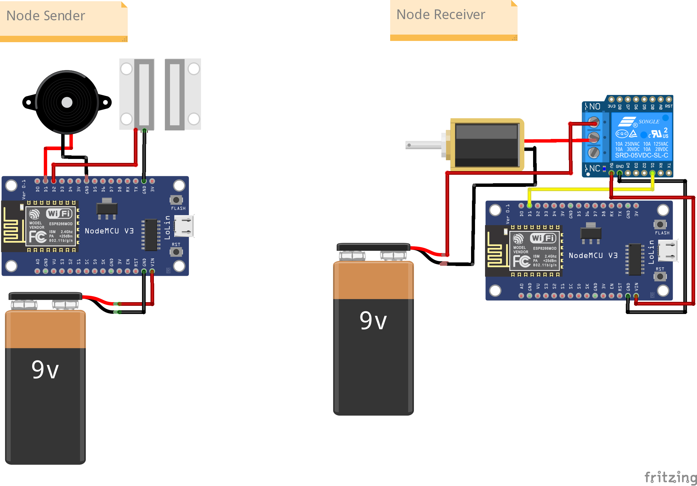
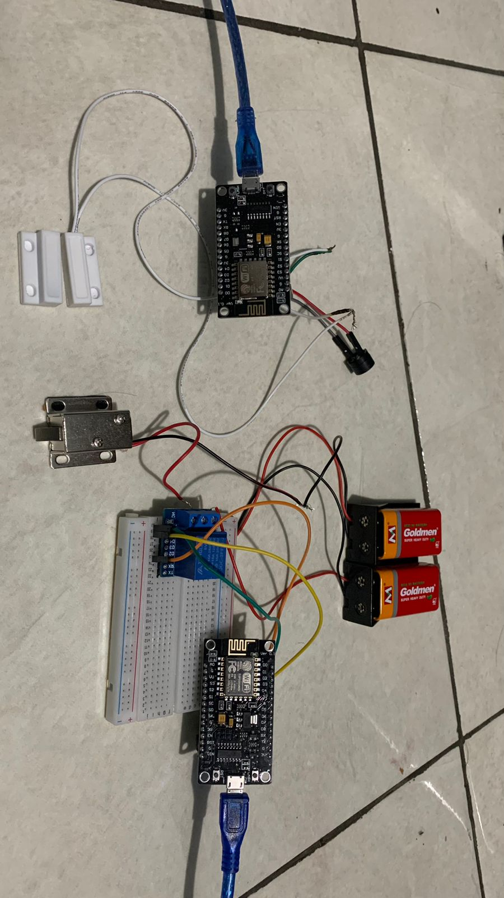

# Project Smart Door Berbasis IoT 
**Nama Kelompok:**
Al-Alamin

**Anggota:**
1. FERIKHO FATIH AZHAR (1103202190)
2. MOHAMAD AQWAM FARID (1103201263)
3. KRESHNA PUTRA S.    (1103202215)
4. NURDIN              (1103204006)
5. ADAM AL-AZIZ OLII   (1103204045)

**Institusi:**
Telkom University

# Ringkasan Project
Project ini bertujuan untuk merancang sistem smart door atau pintu cerdas berbasis IoT. Sistem ini nantinya akan dapat mendeteksi apabila terjadi usaha pembobolan pintu yang tidak diinginkan, lalu mengirim sinyal yang dapat memicu alarm untuk berbunyi.

**Perkiraan waktu pengerjaan yang dibutuhkan**

Sekitar 3 jam


# Pendahuluan
**Latar Belakang:**
Kemajuan teknologi mendorong peningkatkan kualitas serta efektivitas segala aspek kehidupan manusia. Keamanan adalah salah satu aspek yang perlu untuk diperhatikan dan senantiasa diperbarui kualitasnya. Dengan sistem smart door yang kami buat, proses monitoring keamanan pintu dapat dilakukan dengan lebih mudah dan efisien serta lebih optimal dalam penggunaan sumber dayanya.

**Tujuan:**
Dapat memahami konsep IoT sederhana serta menerapkannya dengan cara merancang suatu alat, yakni Sistem Smart Door Berbasis IoT.

**Manfaat:**
Dapat memahami dasar-dasar dalam perancangan alat IoT meliputi pembuatan kodingan, rangkaian elektronik, jaringan, serta database. 

# Alat-alat
Komponen | Fungsi | Jumlah | Harga Satuan
-| -| -| -
ESP8266 NodeMCU V3 | Mengumpulkan data dari sensor, melakukan transfer data, menggerakkan aktuator | 2 | Rp 55.000
Buzzer | Digunakan untuk alarm ketika pintu terbuka | 1 | Rp 1.800
MC-38 Sensor | Sensor magnetik yang dapat mengirimkan sinyal biner 0 atau 1 | 1 | Rp 9.000
Solenoid Lock | Sebagai aktuator untuk mengunci pintu | 1 | Rp 43.000
Relay 5V | Sebagai pengendali arus listrik rangkaian | 1 | Rp 5.000
Baterai 9V | Sebagai penyuplai daya pada rangkaian | 2 | Rp 10.000


Gambar 1 : Alat-alat yang digunakan


# Setup
**Setup IDE:**

Download dan Install PlatformIO pada VSCode untuk menyusun kode program.

Download dan install library yang diperlukan untuk project, antara lain :
1. PubSubClient
2. ESPNow
3. TaskScheduler

# Desain Rangkaian

Gambar 2 : Desain rangkaian

Sistem terdiri dari dua node. Node pertama sebagai sender dan node kedua sebagai receiver.

Untuk node pertama, kabel positif sensor MC-38 terhubung ke pin D2 node MCU dan kabel negatif ke pin ground. Lalu, pin positif buzzer terhubung ke pin D1 dan kabel negatif ke pin ground node MCU.

Untuk node kedua, pin D1 pada relay dihubungkan dengan pin D1 node MCU, pin 5V terhubung ke pin Vin node MCU, dan pin ground relay terhubung ke pin ground node MCU. Lalu, untuk kabel positif solenoid lock terhubung ke pin COM relay, dan kabel negatif solenoid lock terhubung ke kabel negatif power supply. Sedangkan kabel positif power supply terhubung ke pin NO pada relay.

# Platform yang digunakan
Platform yang digunakan sebagai antarmuka atau dashboard adalah Node-RED. Node-RED adalah alat pemrograman visual berbasis web yang dibangun di atas Node.js. Node-RED dapat digunakan untuk membuat desain antarmuka grafis berbasis browser yang memungkinkan pengguna untuk membuat alur kerja (flow-based programming) dengan menghubungkan node-node yang mewakili fungsi atau layanan berbeda. 


Gambar 3 : Node-RED Flow


Gambar 4 : Dashboard Node-RED

# Coding Program
**Node Sender:**
```cpp
#include <ESP8266WiFi.h>
#include <ESPNowW.h>
#include <TaskScheduler.h>

Scheduler taskScheduler;

const int sensorPin = D2;
const int buzzerPin = D1;

uint8_t broadcastAddress[] = {0x48, 0x55, 0x19, 0xF0, 0xC7, 0x9B};

struct struct_message {
   int sensorValue;
};
struct_message dataToSend;

void OnDataSent(uint8_t *mac_addr, uint8_t sendStatus) {
  Serial.print("Last Packet Send Status: ");
  if (sendStatus == 0) {
    Serial.println("Pengiriman sukses");
  } else {
    Serial.println("Pengiriman Gagal");
  }
}


void readSensor(); // Declare readSensor function

Task taskSensor(100, TASK_FOREVER, &readSensor);

void readSensor() {
  // Baca sensor MC38
  int sensorValue = digitalRead(sensorPin);

  // Buat objek struct_message dan isi nilai sensor
  dataToSend.sensorValue = sensorValue;

  // Kirim data melalui ESPNow
  esp_now_send(broadcastAddress, (uint8_t*)&dataToSend, sizeof(dataToSend));

  // Cek nilai sensor
  if (sensorValue == 1) {
    digitalWrite(buzzerPin,HIGH); //hidupkan buzzer
    delay(100);
    digitalWrite(buzzerPin,LOW); //matikan buzzer
    delay(100);
  } else {
    // Jika nilai sensor adalah 1, aktifkan buzzer
    digitalWrite(buzzerPin,LOW); // matikan buzzer
  }

  // Lakukan sesuatu dengan nilai sensor, contoh: cetak nilai
  Serial.print("Sensor Value: ");
  Serial.println(sensorValue);
}

void setup() {
  // Init Serial Monitor
  Serial.begin(115200);

  // Set device as a Wi-Fi Station
  WiFi.mode(WIFI_STA);

  // Init ESP-NOW
  if (esp_now_init() != 0) {
    Serial.println("Error initializing ESP-NOW");
    return;
  }

  esp_now_set_self_role(ESP_NOW_ROLE_CONTROLLER);
  esp_now_register_send_cb(OnDataSent);

  // Register peer
  esp_now_add_peer(broadcastAddress, ESP_NOW_ROLE_SLAVE, 1, NULL, 0);

  pinMode(sensorPin, INPUT_PULLUP);
  pinMode(buzzerPin, OUTPUT);

  taskScheduler.init();
  taskScheduler.addTask(taskSensor);
  taskSensor.enable();
  taskScheduler.startNow();
  readSensor();
}

void loop() {
  // Eksekusi tugas pada jadwal yang ditentukan oleh scheduler
  taskScheduler.execute();
}
```

**Node Receiver:**
```cpp
#include <Arduino.h>
#include <ESP8266WiFi.h>
#include <PubSubClient.h>
#include <ESPNowW.h>

const int relayPin = 2;


const char *ssid = "Ikooo's WiFi";
const char *password = "23112311";

const char *mqtt_broker = "broker.emqx.io";
const char *topic1 = "kelasiotesp/Al-Alamin/relay";
const char *mqtttopic = "kelasiotesp/Al-Alamin/sensor";
const char *mqtt_username = "emqx";
const char *mqtt_password = "public";
const char *clientId = "MASKO";

const int mqtt_port = 1883;

WiFiClient espClient;
PubSubClient client(espClient);
uint32_t counter;
char str[80];

typedef struct struct_message {
    int sensorValue;
} struct_message;

struct_message receivedData;

void OnDataRecv(uint8_t * mac, uint8_t *incomingData, uint8_t len) {
  memcpy(&receivedData, incomingData, sizeof(struct_message));
if (receivedData.sensorValue == 1) {
    digitalWrite(relayPin, HIGH); // Aktifkan alarm
    Serial.println("Alarm: Terdeteksi Pembobolan Pintu!");
    delay(1000); // Tambahkan delay untuk suara alarm atau tindakan lainnya
    digitalWrite(relayPin, LOW); // Matikan alarm
    if (client.connected()) {
      client.publish(mqtttopic, "Terdeteksi Pembobolan Pintu!");
    }
}
}
void callback(char *topic, byte *payload, unsigned int length) {
  Serial.print("Message arrived in topic: ");
  Serial.println(topic);
  Serial.print("Message: ");

  for (unsigned int i = 0; i < length; i++) {
    Serial.print((char)payload[i]);
  }
  Serial.println();
  Serial.println("Relay status: ");

  String payloadStr = "";
  for (unsigned int i = 0; i < length; i++) {
    payloadStr += (char)payload[i];
  }

  if (strcmp(topic1, topic1) == 0) { 
    if (payloadStr.equals("0")) { 
      digitalWrite(relayPin, HIGH); 
      Serial.println("Relay turned ON");
    } else if (payloadStr.equals("1")) { 
      digitalWrite(relayPin, LOW);  
      Serial.println("Relay turned OFF");
    }
  }

  Serial.println();
}


void setup() {

 Serial.begin(115200);

 WiFi.begin(ssid, password);
 while (WiFi.status() != WL_CONNECTED) {
     delay(500);
     Serial.println("Connecting to WiFi..");
 }
 Serial.println("Connected to the WiFi network");
 
 client.setServer(mqtt_broker, mqtt_port);
 client.setCallback(callback);
 while (!client.connected()) {
     String client_id = "esp8266-client-";
     client_id += String(WiFi.macAddress());
     Serial.printf("The client %s connects to the public mqtt broker\n", client_id.c_str());
     if (client.connect(client_id.c_str(), mqtt_username, mqtt_password)) {
         Serial.println("Public emqx mqtt broker connected");
     } else {
         Serial.print("failed with state ");
         Serial.print(client.state());
         delay(2000);
     }
    if (esp_now_init() != 0) {
    Serial.println("Error initializing ESP-NOW");
    return;
  }

  esp_now_set_self_role(ESP_NOW_ROLE_SLAVE);
  esp_now_register_recv_cb(OnDataRecv);
 }
 
  client.publish(topic1, "Hi EMQX I'm esp ^^");
  client.subscribe(topic1);
 
  pinMode(relayPin, OUTPUT);
}

void reconnect() {
  while (!client.connected()) {
    String client_id = "esp8266-client-";
    client_id += String(WiFi.macAddress());
    Serial.printf("Attempting to reconnect to the public MQTT broker as %s\n", client_id.c_str());
    if (client.connect(client_id.c_str(), mqtt_username, mqtt_password)) {
      Serial.println("Reconnected to MQTT broker");

      client.subscribe(topic1);
  
    } else {
      Serial.print("Reconnect failed, state=");
      Serial.print(client.state());
      Serial.println(". Retrying in 5 seconds...");
      delay(5000);
    }
  }
}

void loop() {
 client.loop();
 if (!client.connected()) {
    reconnect();
  }
  delay(1000);
}
```

# Konektivitas dan Pertukaran Data


# Presenting the data


# Desain Final

Gambar 5 : Berikut adalah foto dari rangkaian final dari project yang telah kami buat

# Kesimpulan
Meskipun banyak tantangan yang dilalui, namun pada akhirnya kami berhasil menyelesaikan project ini. Setelah berhasil menyelesaikan project Smart Door Berbasis IoT ini, kami mendapatkan banyak pelajaran terutama terkait dengan pemahaman mengenai konsep IoT. Kami belajar bagaimana cara mendesain suatu rangkaian, menyusun rangkaian, membuat kode supaya rangkaiannya bisa berjalan sesuai dengan yang kita inginkan, serta menghubungkan kode tersebut dengan dashbord UI.

